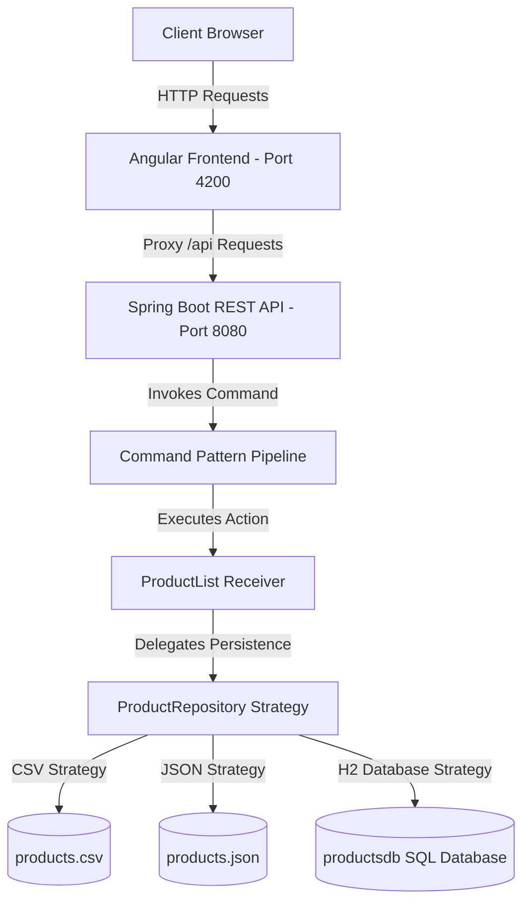

# AeroInventory - Next-Generation Polymorphic Product Management

AeroInventory is a modern full-stack web application designed for polymorphic product management. It features a hot-swappable storage engine picker, high-performance database querying, price range filtering, responsive layouts, and a clean, refreshing user interface built with Angular and Bootstrap 5.

---

## 🏗️ System Architecture

AeroInventory is designed using a decoupled, pattern-driven architecture that separates the client interface, API controller gateway, execution pipeline, and persistence engines.



### 1. Backend Design Patterns (Spring Boot)
The backend is structured around three primary software design patterns:
*   **Polymorphic Model Hierarchy**: The core entity system starts with the `Product` interface and the [AbstractProduct](file:///home/dhananjaydiwan/my-app/src/main/java/com/mycompany/app/AbstractProduct.java) base class, which is implemented in two distinct polymorphic forms:
    *   [PhysicalProduct](file:///home/dhananjaydiwan/my-app/src/main/java/com/mycompany/app/PhysicalProduct.java): Handles tangible products and tracks custom metrics like `weight`.
    *   [DigitalProduct](file:///home/dhananjaydiwan/my-app/src/main/java/com/mycompany/app/DigitalProduct.java): Manages virtual inventory and maps download metadata like `downloadUrl`.
*   **Strategy Pattern (Decoupled Repositories)**: Storage engines are abstracted through the [ProductRepository](file:///home/dhananjaydiwan/my-app/src/main/java/com/mycompany/app/ProductRepository.java) interface. A concrete storage engine strategy is loaded dynamically at runtime, enabling hot-swappable engine switches:
    *   [CsvProductRepository](file:///home/dhananjaydiwan/my-app/src/main/java/com/mycompany/app/CsvProductRepository.java): Flat-file serialization matching CSV layouts.
    *   [JsonProductRepository](file:///home/dhananjaydiwan/my-app/src/main/java/com/mycompany/app/JsonProductRepository.java): Hierarchical serialization parsing standard JSON format.
    *   [H2ProductRepository](file:///home/dhananjaydiwan/my-app/src/main/java/com/mycompany/app/H2ProductRepository.java): Relational SQL database mapping storing entities dynamically via JDBC.
*   **Command Design Pattern**: User actions are encapsulated as independent commands implementing the [Command](file:///home/dhananjaydiwan/my-app/src/main/java/com/mycompany/app/Command.java) interface. Commands such as [AddCommand](file:///home/dhananjaydiwan/my-app/src/main/java/com/mycompany/app/AddCommand.java), [DeleteCommand](file:///home/dhananjaydiwan/my-app/src/main/java/com/mycompany/app/DeleteCommand.java), [UpdatePriceCommand](file:///home/dhananjaydiwan/my-app/src/main/java/com/mycompany/app/UpdatePriceCommand.java), and [SwitchRepoCommand](file:///home/dhananjaydiwan/my-app/src/main/java/com/mycompany/app/SwitchRepoCommand.java) are processed by [ProductList](file:///home/dhananjaydiwan/my-app/src/main/java/com/mycompany/app/ProductList.java), decoupling user requests from direct business logic.

### 2. Frontend Design Patterns (Angular & Bootstrap 5)
*   **Standalone Components & Modern Signals**: The frontend relies on modern Angular features, including reactive Angular Signals for component state management, maximizing template render speeds without heavy digest cycles.
*   **Bootstrap 5 Light Mode**: Clean, refreshing design utilizing light backgrounds, modern typography (Plus Jakarta Sans), responsive layouts, and soft CSS transitions for hover actions.
*   **Reverse Proxy Forwarding**: Bypasses browser CORS constraints by forwarding local `/api` routes directly to the Spring Boot REST API through a developer webserver proxy definition.

---

## 🚀 Key Functionality

*   **Hot-Swappable Repository Engine**: Switch your active storage engine instantly between **CSV**, **JSON**, or **H2 Database** via UI controls. All data loads and updates sync instantly.
*   **Polymorphic Field Customization**: Form fields automatically adjust based on the selected product type:
    *   Selecting **Physical** prompts for `Weight (kg)`.
    *   Selecting **Digital** prompts for `Download URL`.
*   **Search Filter**: Query products within a specified minimum and maximum price range.
*   **Visual Representation Switcher**: Switch views instantly between a dynamic responsive **Grid of tiles** or a clean tabular **List layout**.
*   **Live Price Editor**: Update prices inline from either layout instantly.

---

## 🛠️ API Specifications

The backend exposes a structured REST API at `http://localhost:8080/api/products`:

| HTTP Method | Route | Parameter / Body | Description |
|---|---|---|---|
| **GET** | `/api/products` | None | Retrieve all products in active storage engine |
| **POST** | `/api/products` | `Product` (JSON body) | Creates a new polymorphic product |
| **GET** | `/api/products/search` | `min` (double), `max` (double) | Queries products in price range |
| **DELETE** | `/api/products/{name}` | `{name}` (path parameter) | Removes target product |
| **PATCH** | `/api/products/{name}/price` | `{name}` (path parameter), `Double` (body) | Updates product price |
| **GET** | `/api/products/repository` | None | Gets active storage engine type (`CSV`/`JSON`/`H2`) |
| **POST** | `/api/products/repository` | `type` (request parameter) | Switches active storage engine |

---

## 💻 Setup and Execution

### Prerequisites
*   **Java SE Development Kit (JDK)** version 17 or higher
*   **Apache Maven** version 3.8+
*   **Node.js** version 18.x or higher
*   **npm** package manager (comes bundled with Node.js)

---

### Step 1: Run the Backend Server
1. Navigate to the root directory of the application:
   ```bash
   cd /home/dhananjaydiwan/my-app
   ```
2. Build and run the Spring Boot server using Maven:
   ```bash
   mvn spring-boot:run
   ```
3. The server will start on port `8080` (accessible at `http://localhost:8080`).

---

### Step 2: Run the Frontend Server
1. Navigate to the frontend directory:
   ```bash
   cd /home/dhananjaydiwan/my-app/frontend
   ```
2. Install the application dependencies:
   ```bash
   npm install
   ```
3. Start the Angular local development server:
   ```bash
   npm run start
   ```
4. The Angular dev server will start on port `4200` (accessible at `http://localhost:4200`).

---

### Bypassing CORS (Proxy Configuration)
Inside the [proxy.conf.json](file:///home/dhananjaydiwan/my-app/frontend/src/proxy.conf.json), requests targeting `/api` are mapped directly to the local Spring Boot backend:
```json
{
  "/api": {
    "target": "http://localhost:8080",
    "secure": false
  }
}
```
This ensures browser requests match the webserver origin, preventing CORS blocks.
